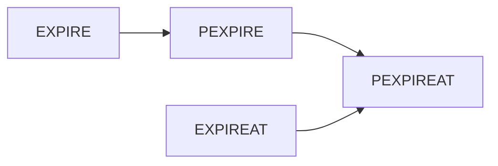

# 过期键维护 
```c++
typedef struct redisDb{
    ...
    dict *expire
} redisDb
```

## 命令
[[expireAt]][[ttl]] 
### 设置过期时间 EXPIRE
```
// key 不存在或设置失败，返回 0
EXPIRE key seconds // n 秒后过期
PEXPIRE key millseconds // 单位毫秒
EXPIREAT
PEXPIREAT
```

### 剩余过期时间 TTL
```
TTL key // 返回 自动删除 还有多少秒
```
### 移除过期时间 PERSIST

## 实现
### String -> longlong
### EXPIRE 命令转换


## 过期维护操作

### 定期删除
定时检查 接着上次 db[] 进度 遍历 db[], 随机部分 key
`redis.c/ServerCron`服务器周期函数 中 分配 ** 可执行时间 **
去执行 `redis.c/activeExpireCycle`

### 惰性删除
读写命令访问到才 `db.c/expireIfNeeded` 判断过期删除

### 主动淘汰策略
定期+惰性都没清理， 内存又快爆了， 额外策略维护，删除不重要的
[[主动淘汰策略]]

<div align="center">  </div>

清理过程是阻塞的， 样本池抽样

## 过期键 在持久化、复制功能 的影响

### RDB 
#### 生成
忽略过期
#### 载入
主 载入 忽略过期
从 载入 不忽略过期， 但主同步时 会清空从 再复制

结果 多是忽略

### AOF
AOF生成时，键被惰性删除时 AOF中有显式DEL记录
AOF重写时，会忽略过期键

### 复制
主 删过期通知从
从 不主动删, 等通知， 此时访问会**不一致**


