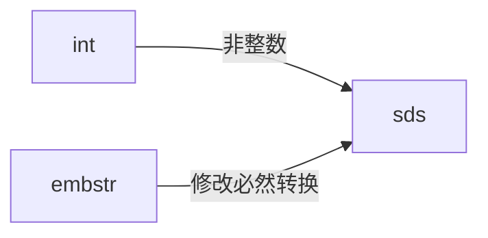

# Redis 字符串实现
## 实现/ 编码方式
 - [[sds]] 也称为 raw
 - [[embstr]] 
 - int long 类型能表示的整数
 
## 背景
### int
如果一个字符串对象保存的是整数值， 并且这个整数值可以用 long 类型来表示， 那么字符串对象会将整数值保存在字符串对象结构的 ptr 属性里面（将 void* 转换成 long ）， 并将字符串对象的编码设置为 int 。

long double 表示的浮点数，更长的数字，字符串值 等 都 用其他方式来表示
### emstr
如果字符串对象保存的是一个字符串值， 并且这个字符串值的长度大于 39 字节， 那么字符串对象将使用一个简单动态字符串（SDS）来保存这个字符串值， 并将对象的编码设置为 raw 。
sds 与 redisObject 连续 内存里

### sds 
#### C 字符串特点 ( 内存管理 & 长度复杂度 )
C 字符串 有如下特点
-   空间分配。长度改变，内存重新分配。
-   溢出问题。C 处理数组和字符串，要考虑分配空间，溢出等问题
-   长度获取复杂度高。获取长度需要遍历，O ( n )

## 转换

## 整数
0～9999 整数值 [[内存共享]]