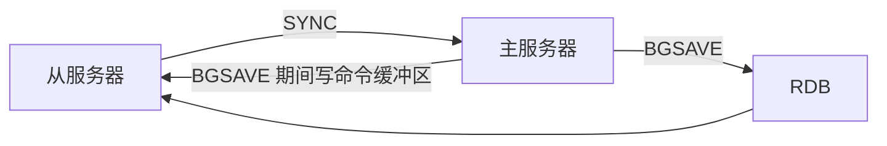

# 主从复制
## 命令
slaveof master_ip
## 复制过程
1. 主服务器端口&地址
2. 建立 Socket
3. ping 命令（redis 命令）回复 pong
4. 从服务器 masterauth & 主服务器 requirepass。决定是否进行身份验证。AUTH 命令验证，主从密码要一致
5. 从服务器发送监听端口 给主
6. 同步 PSYNC
7. 命令传播 伴随 心跳检测

最关键 是 **同步** 和 **命令传播** 

### 同步
#### 旧版
V2.8-

#### 新版 PSYNC
V2.8+
完整重同步 SYNC
部分重同步
#### 部分重同步 实现
主服务器 复制偏移量 offset 
    累计字节数
主服务器 复制积压缓冲区 backlog 
    1mbFIFO 缓存着写命令
服务器运行 id 
    判断是否之前主服务器的 runid

### 命令传播
主服务器 执行 写命令  发送相同命令给从服务器

### 心跳检测
`replyconf ack <offset>`
检查网络连接状态
命令丢失
辅助实现 min-slave
####  min-slaves
从 服务器足够 且 回复延迟lag足够小 才允许写

### 缺陷
初次复制 没问题
断线后复制 重新 Sync RDB 重新生成**（但不必要）**

## 新版
v2.8+
