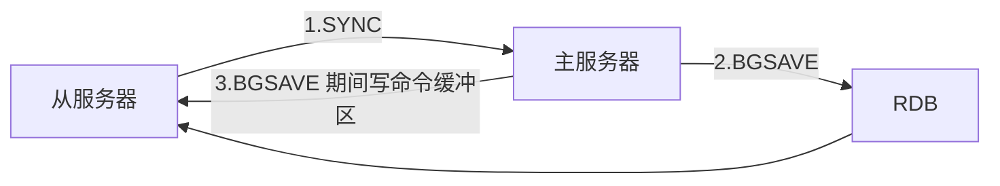

# 同步
## 旧版
V2.8-

### 缺陷： 全量
初次复制 没问题
断线后复制 重新 Sync RDB, 重新生成 **（但不必要）**

## 新版 PSYNC
V2.8+
完整重同步 SYNC
部分重同步：量少 避免抖动掉线，增量恢复

### 部分重同步 实现
#### 主服务器 复制偏移量 offset 
    累计字节数
#### 主服务器 复制积压缓冲区 backlog 
    1mb FIFO 缓存着写命令
#### 服务器运行 id 
    判断重连的服务器 是否之前主服务器的 runid
    避免全量

