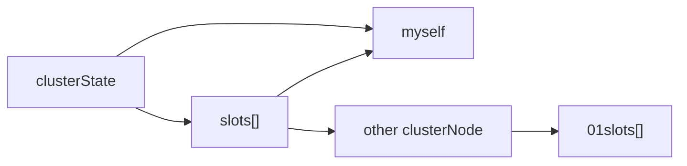

# 集群 CLUSTER

配置 cluster-enabled = yes 启动
向A节点 发送`CLUSTER MEET <B_ip> <B_port>` 连接成集群

集群模式只能使用reidsDb[0]
 
redis-trib 管理工具

## port
redis cluster架构下的每个redis都要开放两个端口号，比如一个是6379，另一个就是加1w的端口号16379。

## 集群 & 节点
clusterState 集群状态
clusterNode 节点状态  clusterState->nodes
clusterLink[] 连接集群里其他节点

### 分片: 槽， 1 node 负责 n slot
### 数据分区 
2048bytes * 8 = 16383 个 slot
槽分配给节点`1 node: n slot`
### 节点 -> slot : range 平均分配
16384**槽按照节点数量进行平均分配**，由节点进行管理

### slot 和节点的相互映射
slot 到节点的映射 
节点 使用 01 slot[] 记录 负责的 slot, 常用整个数组传播

### 重新分片 reshard
redis-trib
1. target 做好准备
2. source 做好准备
3. batch 获取键名， each 迁移
4. 广播集群 setslot to target

### 集群优点
> 三个臭皮匠 ...

机器成本 使用低成本机器 
空间 可以靠机器拓展
性能 平衡 1/n
物理位置 靠近用户 

## 键 定位 槽
hash 取模 `slot_num = CRC16(key) & 16383`

### 重定向
[[重定向]]

### skiplist slot_to_keys
clusterState -> slot_to_keys 用 跳表 维护
key -> slot（score) 映射

## 建立集群 Gossip 协议
[[gossip]]

## 集群 可用性
### 集群 主从复制
`cluster replicate <node_id>`
clusterNode -> slaveOf 指向 主节点

### 故障检测 raft协议
有多个主节点 每个不同范围的槽

某个主节点A  的 从节点B 发现  A
PING PONG 延时 标记 A 主节点 FAIL （比Gossip 快）

从节点 让主节点(not A) 投票选自己 B 替换主节点
遵循 [[RAFT]]协议

## 消息
### 通过消息通信 pubsub
不通过命令通信, 

