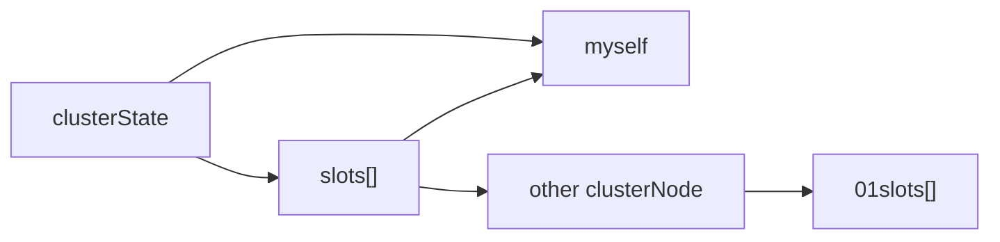

# 集群

配置 cluster-enabled = yes 启动
向A节点 发送`CLUSTER MEET <B_ip> <B_port>` 连接成集群

集群模式只能使用reidsDb[0]
 
redis-trib 管理工具

## port
redis cluster架构下的每个redis都要开放两个端口号，比如一个是6379，另一个就是加1w的端口号16379。

## 集群 & 节点
clusterState 集群状态
clusterNode 节点状态  clusterState->nodes
clusterLink[] 连接集群里其他节点

### 分片 槽
2048bytes * 8 = 16383 个 slot
槽分配给节点`1 node: n slot`

### slot 和节点的相互映射
slot 到节点的映射 
节点 使用 01slot[] 记录 负责的 slot, 常用整个数组传播

### 重新分片
redis-trib
1. target 做好准备
2. source 做好准备
3. batch 获取键名， each 迁移
4. 广播集群 setslot to target

### 优点
> 三个臭皮匠 ...

机器成本 使用低成本机器 
空间 可以靠机器拓展
性能 平衡 1/n
物理位置 靠近用户 

## 键 定位
hash 取模 `slot_num = CRC16(key) & 16383`

### 重定向
定位的槽 非本节点负责时 重定向
发送 MOVED ERR 告诉 *客户端* 向谁取。集群模式的客户端会自行访问。

#### ASKING
ASKING 打开 RDIS_ASK(ING 标志， 只对 后续一条命令 生效
ASK ERR 正在迁移槽 的临时措施

### skiplist slot_to_keys
clusterState -> slot_to_keys 用 跳表 维护
key -> slot（score) 映射

## 建立集群 Gossip 协议
[[gossip]]
cluster gossip协议定义在在ClusterMsg这个结构中

### 三个命令 握手
MEET 向目标节点发送邀请
PONG 带有自己已知节点信息 
PING 带有自己已知节点信息

### 广播
#### 如何减少信息量
PING 每个节点每秒会执行 10 次 ping，每次会选择 5 个最久没有通信的其它节点。
当然如果发现某个节点通信延时达到了 cluster_node_timeout / 2，那么立即发送 ping，
每次 ping，会带上自己节点的信息，还有就是带上 1/10 其它节点的信息，发送出去，进行交换。至少包含 3 个其它节点的信息，最多包含 总节点数减 2 个其它节点的信息。

## 集群 可用性
### 集群 主从复制
`cluster replicate <node_id>`
clusterNode -> slaveOf 指向 主节点

### 故障检测 raft协议
PING PONG 延时 标记主节点 FAIL （比Gossip 快）
从节点 让主节点投票选自己替换主节点

遵循 RAFT协议

## 消息
### 通过消息通信
不通过命令通信

