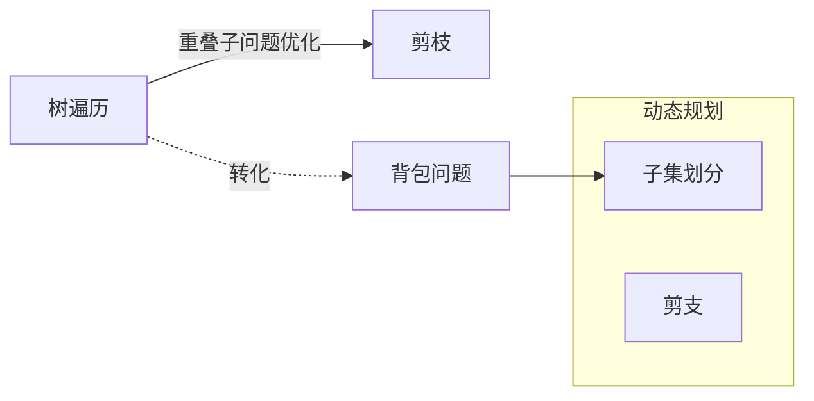

# 对比：回溯算法和动态规划

## 回顾
[[动态规划]]
[[回溯算法]]

## 对比
**回溯**，描述的是决策树的遍历方向（执行和撤销操作）细节
本质是穷举，暴力解决，性能不高。
遍历过程可通过备忘录剪枝优化。（也属于动态规划的方法）

有时, 可以把问题转化为如背包问题，子集划分等，降低复杂度。（也属于动态规划的方法）

## 结论
动态规划 是 回溯 的一种优化手段

## 例子
[[目标和]]