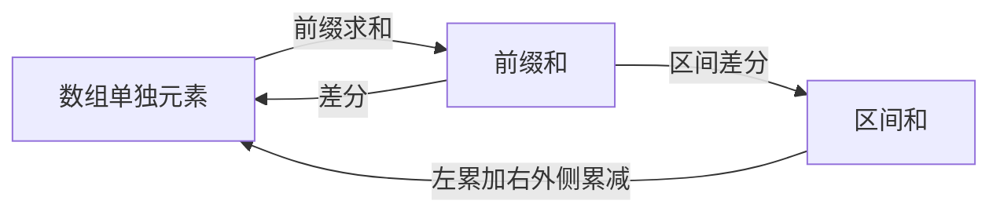
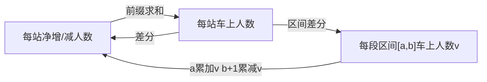

# 前缀和
## 关键词

数组区间
连续子数组

前缀和

## 暴力分析
```java
int subarraySum(int[] nums, int k) {
    int n = nums.length;
    // 构造前缀和
    int[] sum = new int[n + 1];
    sum[0] = 0; 
    for (int i = 0; i < n; i++)
        sum[i + 1] = sum[i] + nums[i];

    int ans = 0;
    // 穷举所有子数组
    for (int i = 1; i <= n; i++)
        for (int j = 0; j < i; j++)
            // sum of nums[j..i-1]
            if (sum[i] - sum[j] == k)
                ans++;

    return ans;
}

```
### 优化 合并循环，同时计算当前前缀和 和 找出现过的前缀和


## 差分数组， 区间和， 前缀和相互转化


### 具体场景


## 坑点
### 区间和 sum 要先取后设，因为可能有重复的， 不能直接设置为1


## 题目
[[和为K的子数组]]
[[航班预订系统]]

