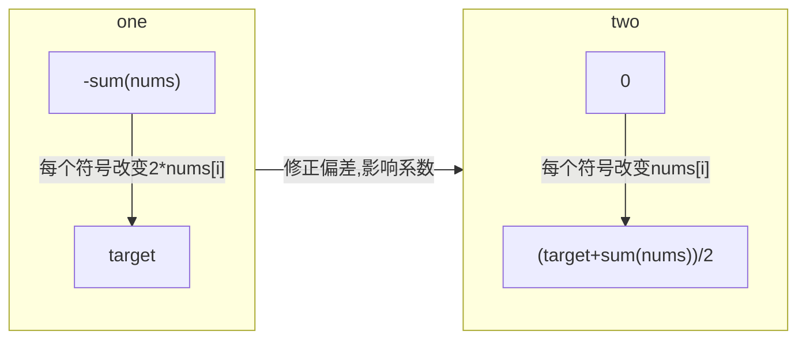

# 494 目标和
## 题目
[NO.494](https://leetcode-cn.com/problems/target-sum/)

给定一个非负整数数组，a1, a2, ..., an, 和一个目标数，S。现在你有两个符号 + 和 -。对于数组中的任意一个整数，你都可以从 + 或 -中选择一个符号添加在前面。

返回可以使最终数组和为目标数 S 的所有添加符号的方法数。

来源：力扣（LeetCode）
链接：https://leetcode-cn.com/problems/target-sum
著作权归领扣网络所有。商业转载请联系官方授权，非商业转载请注明出处。

## 相关概念
[[回溯算法]]  
[[动态规划]]  
[[系列-背包问题]]  

## 思路
### 回溯 
套模板 [[回溯算法#套路]]
1. 状态 
 - 位置`i`
 - 当前和`sum`

2. 遍历结束条件

`i == nums.length`

3. 满足条件的状态

` sum = S ` 转化为 `rest = S-sum = 0` 减少参数

4. 可选操作
 - `+`
 - `-`
状态变化对应（倒过来）
 - `rest - nums[i]`
 - `rest + nums[i]`

5. 回溯函数确定 

伪代码，状态可以放在全局
```java 
    // 方法数
    public static int res;
    public void backTrack(int[]nums, int i, int rest ){
        if(i == nums.length - 1 ){
            if(rest == 0){
                res++;
            }
            return;
        }
       // -
        backTrack( nums, i+1, rest+nums[i]);
        // +
        backTrack( nums, i+1, rest-nums[i]);
    }
    
```
### 动态规划优化
#### 备忘录
二元状态是 `(i,rest)` 主要应对 `rest+nums[i] == rest - nums[i]`
可以使用 HashMap 做备忘录，关键代码
因为要复用结果，所以函数也要带上返回值
```java 
    public int dpByMemo(int[]nums, int i, int rest ){
        //备忘录
        String key = i+'-'+rest;
        if (memo.containsKey(key)) {
            return memo.get(key);
        }
        if(i == nums.length - 1 ){
            if(rest == 0){
                return 1;
            }
            return 0;
        }
        int res =  0;
        // -
        res += dpByMemo( nums, i+1, rest+nums[i]);
        // +
        res += dpByMemo( nums, i+1, rest-nums[i]);

        memo.put(key, res);
        return res;
    }
    
```

最坏复杂度没变
#### 转化为**子集划分**问题
已知：
```
sumPlus - sumMinus = S  
sumPlus + sumMinus = sumNums  
```
推导出`sumPlus = (S + sumNums)/2`一个已知固定值

目标转化为 nums 中和为 sumPlus 的子集数，是一个 01 背包问题。

回顾下
[[01 背包]]  
[[01 背包#思路]]

## 复杂度
- 回溯是 `O(2^n)`
- 备忘录最坏复杂度是`O(2^n)`，优化不大
- 子集划分`O(n*sum)`

## code
01 背包的一维代码
```java
class Solution {
    /**
     * 转化为 01 背包问题
     */
    int findTargetSumWays(int[] nums, int target) {
        int sum = 0;
        for (int n : nums) sum += n;
        // 这两种情况，不可能存在合法的子集划分
        if (sum < target || (sum + target) % 2 == 1) {
            return 0;
        }
        return subset(nums, (sum + target) / 2);
    }
    /**
    * 01 背包套路
    */
    int subset(int[] nums, int target){
        int n = nums.length;
        int[] dp = new int[target+1];
        // base case
        dp[0] = 1;
        for(int i = 1; i<=n; i++){
            for(int j=target ; j>=0; j--) {
                if( j>= nums[i-1]){
                    dp[j] =  dp[j] + dp[j-nums[i-1]];
                }
            }
        }
        return dp[target];
    }
```

## 坑点
要转化问题才看的出是背包，没见过如何想？
从边界开始 [[最优子结构]]
```
// 下边界
-a -b -... = - sum(nums)
// 上边界
+a +b +... = sum(nums)
// 目标
// 若以下边界为开始
// -a 转变成 +a , 每一个负号变为正好target 靠近了多少。
```




## 相似题
[[分割等和子集]]