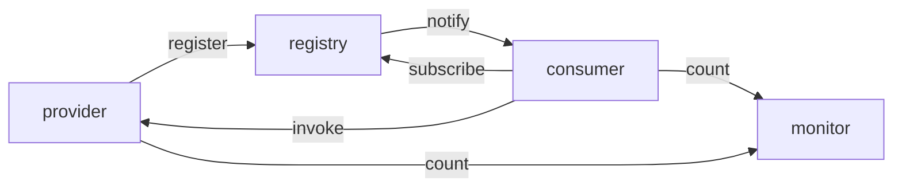

# 服务请求流程

```mermaid
graph LR
provider --register--> registry
consumer --subscribe--> registry
registry --notify--> consumer
consumer --invoke--> provider
consumer --count--> monitor
provider --count--> monitor
```