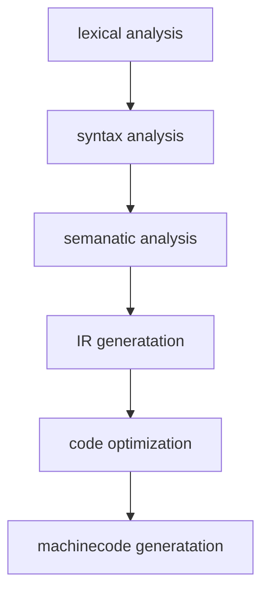

# go 编译

## 依赖
- [[抽象语法树]] AST
- [[SSA]] 静态单赋值
- [[指令集]]

## 编译器 位置
`src/cmd/compile`
## 编译过程

- lexical analysis [[词法分析]]
- syntax analysis [[语法分析]]
- semanatic analysis 语义
- IR generatation 
- code optimization
- machinecode generatation




## 入口

```go
 src/cmd/compile/internal/gc/main.go
 // 传入参数 编译选项和配置
 cmd/compile/internal/gc.Main 
 // 对输入的文件进行词法与语法分析得到对应的抽象语法树
 cmd/compile/internal/gc.parseFiles
```


