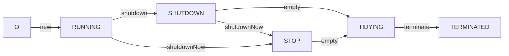

# 线程池状态
## ctl 原子类状态 和 工作线程数
AtomicInteger ctl 
ctl的高三位保存运行状态，低29位保存工作线程的数量，也就是说线程的数量最多只能有(2^29-1)个，也就是上面的CAPACITY

## 5 种状态


线程池的状态一共有五种，分别是RUNNING、SHUTDOWN、STOP、TIDYING、TERMINATED；

- RUNNING，表示可接受新任务，且可执行队列中的任务；
- SHUTDOWN，表示不接受新任务，但可执行队列中的任务；
- STOP，表示不接受新任务，且不再执行队列中的任务，且中断正在执行的任务；
- TIDYING，所有任务已经中止，且工作线程数量为0，最后变迁到这个状态的线程将要执行terminated()钩子方法，只会有一个线程执行这个方法；
- TERMINATED，中止状态，已经执行完terminated()钩子方法；

## shutdown 
### advanceRunState() 自旋+CAS 切换状态
```java
private void advanceRunState(int targetState) {
    for (;;) {
        int c = ctl.get();
        // 如果状态大于SHUTDOWN，或者修改为SHUTDOWN成功了，才会break跳出自旋
        if (runStateAtLeast(c, targetState) ||
            ctl.compareAndSet(c, ctlOf(targetState, workerCountOf(c))))
            break;
    }
}
```
### interruptIdleWorker标记空闲中断

## shutdownNow 标记所有中断
[[ReentrantLock]]
```java
public List<Runnable> shutdownNow() {
    List<Runnable> tasks;
    final ReentrantLock mainLock = this.mainLock;
    mainLock.lock();
    try {
        checkShutdownAccess();
        // 修改为STOP状态
        advanceRunState(STOP);
        // 标记所有线程为中断状态
        interruptWorkers();
        tasks = drainQueue();
    } finally {
        mainLock.unlock();
    }
    tryTerminate();
    return tasks;
}

```